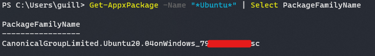
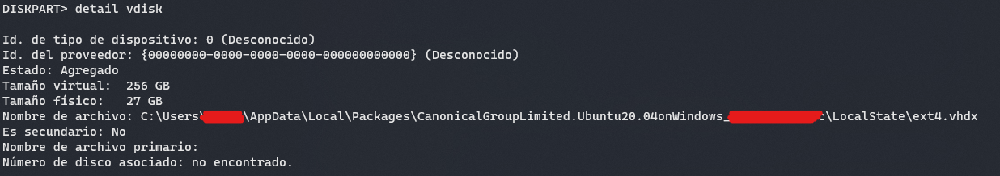

<p align="center">
  <a target="blank"></a>
</p>

# <p align="center"> wsl-issues </p>
<p align="center"> Personal tutorials for wsl issues</p>

## Index
1. [ Shrink disk space reserved by wsl virtual disk. ](#shrink-disk-space)

<a name="shrink-disk-space"></a>
## 1. Shrink disk space reserved by wsl virtual disk

#### 1.1 Terminate all WSL instances and shutdown using the command:
```powershell
PS:\> wsl --shutdown
```


#### 1.2 To find your distribution installation package name ('PackageFamilyName'):

* Using PowerShell (where 'distro' is your distribution name) enter the command:
```powershell
PS:\> Get-AppxPackage -Name "*<distro>*" | Select PackageFamilyName
```
* For example: Get-AppxPackage -Name "*Ubuntu*" | Select PackageFamilyName
```powershell
PS:\> Get-AppxPackage -Name "*Ubuntu*" | Select PackageFamilyName
```



#### 1.3 Use the resulting `PackageFamilyName` to locate the VHD file fullpath used by your WSL 2 installation, this will be your pathToVHD. To find the full path:

* In your Start menu, enter: `%LOCALAPPDATA%` and select to open the %LOCALAPPDATA% file folder.
* Next, open the "Packages" folder and search for the `PackageFamilyName` of your distribution. Open that folder (ie. CanonicalGroupLimited.Ubuntu20.04onWindows_79xxxxx).
* Inside the `PackageFamilyName` folder, open the "LocalState" folder and find the `<disk>.vhdx` file. 
* Copy the path to that file, it should look something like: `%LOCALAPPDATA%\Packages\<PackageFamilyName>\LocalState\<disk>.vhdx`
For example, the `<pathToVHD>` for Ubuntu 20.04 should look something like: `%LOCALAPPDATA%\Packages\CanonicalGroupLimited.Ubuntu20.04onWindows_79xxxx\LocalState\ext4.vhdx`.

#### 1.4 Resize your WSL 2 VHD by completing the following commands:

* Open Windows Command Prompt with admin privileges and enter:

```cmd
diskpart
```

```cmd
DISKPART> Select vdisk file="<pathToVHD>"
```

* In the output of the detail command you can see the disk usage details of the wsl
```cmd
DISKPART> detail vdisk
```



#### 1.5 Compact your WSL 2 VHD
Once done, we finally write the compaction command:
```cmd
DISKPART> compact vdisk
```
> Although it is not absolutely necessary, we can write the commands: `attach vdisk readonly` (before the compact command) and `detach vdisk` (after the compact command) to ensure that no data is written during the process.

It is in this process that the compaction of the .vhdx disk will be carried out. A progress message will appear that will appear to take a long time, but will get faster as you progress.
